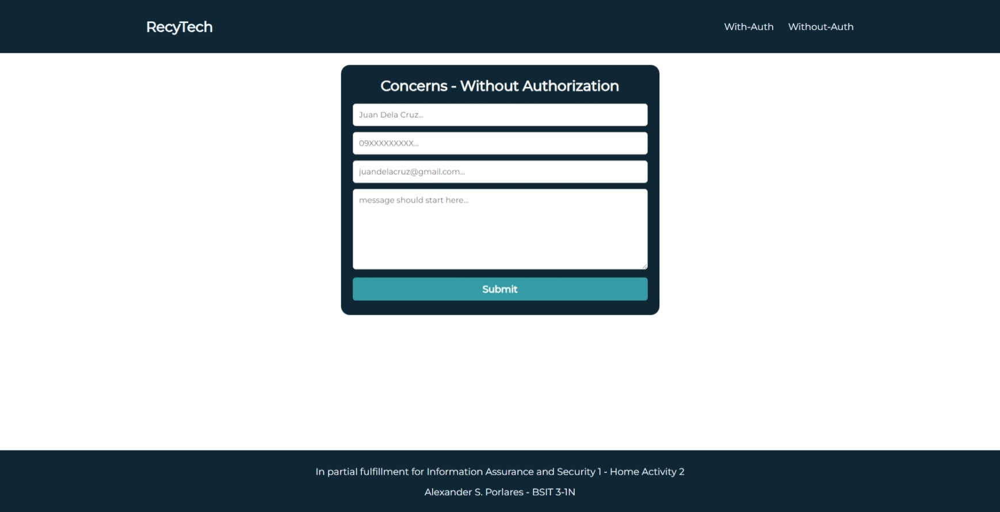
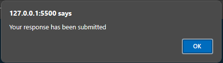
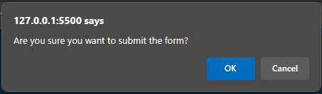
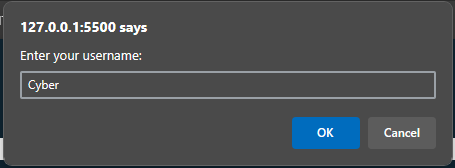
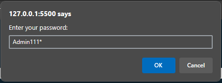

# ♻️ RecyTech ♻️
This website demonstrate downloading a file with and without authorization. This is a requirement for our Information Assurance and Security 1 (IAS 1) class.

## Screenshot
This is the current UI of the website.
<table>
    <tr>
        <td>
            
             
            
With Authorization
</td>   
        <td>
            
                 
                
Without Authorization
</td>
    </tr>

</table>

Alert Prompts
<table>
    <tr>
        <td>
            
             
            
Submitted Alert
</td>   
        <td>
            
                 
                
Confirmation Alert
</td>
    </tr>
    <tr>
        <td>
            
             
            
Username Alert
</td>   
        <td>
            
                 
                
Password Alert
</td>
    </tr>

</table>

## Built With
The following tools and techonologies were involved in the making of this project

* HTML(Hyper Text Markup Language)
* CSS(Cascading Style Sheets)
* JS(Javascript)

(<a href="#top">back to top</a>)

# Contribute
Contributions are what make the open source community such an amazing place to be learn, inspire, and create. Any contributions you make are **greatly appreciated**.
* If you have suggestions for adding or removing projects, feel free to [open an issue](https://github.com/Rednaxela5/RecyTech/issues/new) to discuss it, or directly create a pull request after you edit the *README.md* file with necessary changes.
* Please make sure you check your spelling and grammar.
* Create individual PR for each suggestion.
* Please also read through the [Code Of Conduct](https://github.com/Rednaxela5/nexatech-job-application-portal/blob/main/CODE_OF_CONDUCT.md) before posting your first idea as well.

## Creating A Pull Request

1. Fork the Project
2. Create your Feature Branch (`git checkout -b feature/AmazingFeature`)
3. Clone and checkout that branch locally.
4. Commit your Changes (`git commit -m 'Add some AmazingFeature'`)
5. Push to the Branch (`git push origin feature/AmazingFeature`)
6. Open a Pull Request

 

# License

Distributed under the MIT License. See [LICENSE](https://github.com/Rednaxela5/RecyTech/blob/main/LICENSE) for more information.

# Author

* **Alexander Porlares** - [@Rednaxela5](https://github.com/Rednaxela5)

(<a href="#top">back to top</a>)
